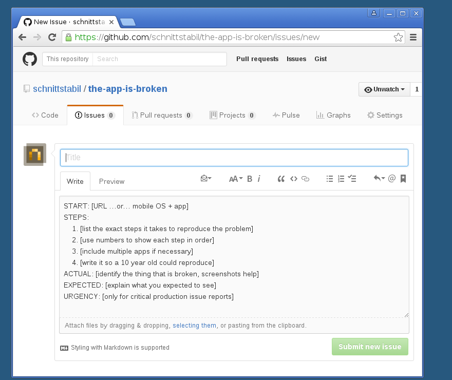

# The App is Broken

> Issue and Pull Request templates based on the @kevinkotowski blog entry at [8thlight.com](https://8thlight.com/blog/kevin-kotowski/2017/01/16/broken-software.html)

## Usage

Copy the `.github` directory into your github project – that's all.

## Related

- See [Issue and Pull Request templates](https://github.com/blog/2111-issue-and-pull-request-templates) if you want to create your own templates.

## License

To the extent possible under law, [Michael Mayer](http://schnittstabil.de) has waived all copyright and related or neighboring rights to this work.
